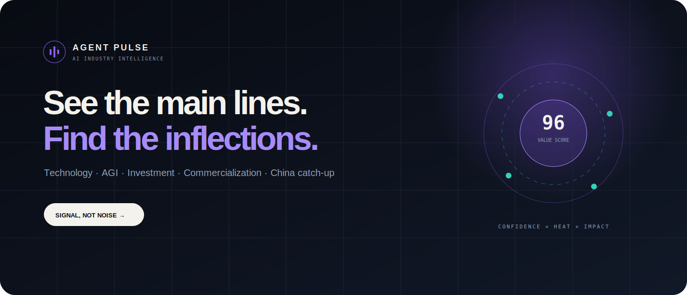

<p align="right">
  <a href="README.md">English</a> · <strong>简体中文</strong>
</p>

<p align="center">
  
</p>

<h1 align="center">Agent Pulse</h1>

<p align="center">
  <strong>Signal, not noise.</strong><br />
  面向 CEO、投资人、创业者和技术负责人的证据型 AI 行业情报系统：中国优先，全球视野。
</p>

<p align="center">
  <a href="https://github.com/barretlee/agent-pulse/actions/workflows/ci.yml"></a>
  <a href="https://github.com/barretlee/agent-pulse/actions/workflows/data-refresh.yml"></a>
  <a href="https://github.com/barretlee/agent-pulse/actions/workflows/source-audit.yml"></a>
  <a href="https://github.com/barretlee/agent-pulse/releases/latest"></a>
  <a href="https://github.com/barretlee/agent-pulse/stargazers"></a>
  <a href="LICENSE"></a>
</p>

<p align="center">
  <a href="https://barretlee.github.io/agent-pulse/"><strong>在线体验</strong></a>
  · <a href="https://github.com/barretlee/agent-pulse/stargazers"><strong>在 GitHub Star</strong></a>
  · <a href="docs/ARCHITECTURE.md">架构</a>
  · <a href="docs/ROADMAP.md">路线图</a>
  · <a href="CHANGELOG.md">Changelog</a>
</p>

## 为什么需要 Agent Pulse

AI 行业不缺链接，缺的是事实与观点分离、重复信息收敛、跨平台热度校准，以及能把技术、资本、政策与商业化放进同一条长期主线的认知系统。

Agent Pulse 不是新闻流。它把厂商发布、论文、监管文件、专家分析与传播信号收敛为可审核的行业事件。每个公开事件都努力回答：

- 发生了什么，原始证据在哪里？
- 为什么重要，会影响谁？
- 它延续、加速或改变了哪一条行业主线？
- CEO、投资人、创业者和技术负责人接下来应该观察什么？

```text
一手事实 + 独立验证 + 传播信号
                  │
                  ▼
      规范化 → 去重 → 聚类 → 审核 → 评分
                  │
                  ▼
 技术 / AGI / 投资 / 商业化 / 中国追赶 / 模型经济学
                  │
                  ▼
       行业判断 · 下一信号 · 行动 · 证据链
```

## 产品能力

- **30 秒决策简报**：直接展示最值得判断的近期事件，清楚区分事实、重要性、影响对象、下一信号和原始证据。
- **战略主线**：技术、AGI、商业化、投资、中国追赶和模型经济学不是普通标签，而是拥有阶段、转折和证据节点的长期时间轴。
- **证据时间轴**：沿时间扫读事件，并下钻一手来源、独立佐证、系统分析和置信度限制。
- **中国牌桌角色雷达**：把模型厂商、云、芯片、开发者生态和应用大厂放进同一个全球竞争背景中观察。
- **决策工具**：提供证据绑定的星探机会、角色追踪、官方模型获取入口、能力核算和诚实的系统评测。
- **Control Room**：管理信源健康、采集、分诊、事件审核、发布门禁、模型资源、星探和静态导出；私有管理能力不会进入 GitHub Pages。

## 当前真实水位

项目当前约为 **Stage 1.9 / 5**，正在进入 Stage 2 底座建设。下面是带日期的验证快照，不是永久不变的营销数字。

| 指标 | 2026-07-12 验证状态 |
| --- | ---: |
| 已分类信源目录 | 258 |
| 最近一次全量审计 healthy | 131 |
| 严格实时有效信源 | 104 |
| E3 隔离观察信源 | 99 |
| E4 生产 canary | 5；评测快照中 4 个 healthy |
| 公开事件 | 44 |
| 包含一手证据的公开事件 | 36 |
| 拥有多个独立来源的公开事件 | 4 |
| 校准后系统评分 | 30 / 100；raw 42；充分证据覆盖 20% |

E0 目录存在、E1 可访问、E2 单次有效、E3 隔离观察和 E4 生产验证是不同水位。目录规模或一次抓取成功不会被包装成生产覆盖。详见[数据源与评分](docs/SOURCES.md)、[能力图谱](docs/CAPABILITIES.md)和机器生成的[信源健康报告](data/reports/source-health-100.json)。

当前缺口也会明确展示：绝大多数来源尚未完成七天生产观察窗；只有 4 个公开事件拥有独立多源证据；Claim 级证据、跨语言语义聚类、完整月度回溯、MySQL 实机 CI 和真实用户结果反馈仍未完成。

## 信源与证据原则

Agent Pulse 按以下顺序优先使用：

1. 官方 API、RSS/Atom、监管披露、论文和 GitHub Releases；
2. 官方公开 JSON 或稳定 metadata；
3. 独立专业验证；
4. 聚合站只用于候选发现与传播线索；
5. robots、服务条款和访问边界允许时，低频获取公开页面的必要 metadata。

系统不会绕过登录、付费墙、验证码、WAF 或平台限制。聚合器不能成为重大事实的唯一证据。新来源必须经过 `draft → shadow → E3 observation → 人工 E4 晋级`，不会因为公开 Issue 或单次探测成功就直接成为事实来源。

提交新信源前请阅读[信源贡献指南](docs/CONTRIBUTING_SOURCES.md)。评分方式、生命周期和 adapter 已知限制见[数据源与评分](docs/SOURCES.md)。

## 架构

```text
官网 / 论文 / 监管 / 专家与传播信号
                  │
         SourceAdapter 统一边界
                  │
      拉取 → 规范化 → 质量门禁 → 去重
                  │
        隔离观察 / Event 事件聚类
                  │
      证据绑定 → 人审 → 发布就绪门禁
            ┌─────┴─────┐
            ▼           ▼
     私有 Control Room   隐私安全静态导出
                              │
                         GitHub Pages
```

默认数据库为 SQLite。项目存在 MySQL 方言路径，但只有完成真实 MySQL 集成验证后才会宣称兼容。公开 Pages 只包含 allowlist 静态 DTO；数据库、原始 payload、凭证、代理配置和私有备注不会导出。

更多文档：[架构](docs/ARCHITECTURE.md) · [能力图谱](docs/CAPABILITIES.md) · [State 1–5 路线图](docs/ROADMAP.md)

## 快速开始

需要 Node.js 22 或更高版本。

```bash
git clone https://github.com/barretlee/agent-pulse.git
cd agent-pulse
npm install
cp .env.example .env
npm run db:migrate
npm run db:seed
npm run dev
```

访问：

- 公开站：<http://127.0.0.1:8899/>
- Control Room：<http://127.0.0.1:8899/admin/>
- 健康检查：<http://127.0.0.1:8899/api/health>

本地开发可以不设置 `ADMIN_TOKEN`；所有非开发环境必须使用至少 16 位的随机 token，并把管理服务放在私有网络或额外访问控制之后。

### 常用命令

```bash
npm run dev                   # 启动本地站点与 Control Room
npm run collect               # 采集、去重、聚类与评分
npm run sources:audit         # 非破坏性全量信源审计
npm run monitor               # 生成信源健康与覆盖报告
npm run evolve -- --once      # 运行一轮有界、可审计的进化循环
npm run export                # 在 dist/ 生成静态站
npm run check                 # lint、typecheck、测试与导出
npm run build                 # 编译服务端 TypeScript
```

## 版本与演进

- **v0.6.0 — The Intelligence Atlas**：上线高密度多页体验、Issue 治理的来源提案、串行数据写入、动态仓库元数据与明确的内容版权边界。
- **v0.5.1 — Snapshot Parity**：恢复本地、定时刷新和 Pages 构建之间的来源健康、运行记录、评测与公开星探一致性。
- **v0.5.0 — The Evidence Engine**：扩张信源网络，建立隔离观察和可逆分诊，修正虚高评测，并把公开体验重构为一手证据优先。

完整记录见 [Changelog](CHANGELOG.md) 和 [GitHub Releases](https://github.com/barretlee/agent-pulse/releases)。路线图会明确区分 planned、experimental 与 operational；设计文档和预留字段不会被描述成已经交付。

## 参与贡献

欢迎贡献信源 adapter、fixture、失败隔离测试、证据质量能力和更清晰的产品表达。

- 代码修改请阅读 [CONTRIBUTING.md](CONTRIBUTING.md)。
- 信源建议和内容纠错请阅读[信源贡献指南](docs/CONTRIBUTING_SOURCES.md)。
- 请遵守[社区行为准则](CODE_OF_CONDUCT.md)。
- 安全问题请按 [SECURITY.md](SECURITY.md) 私下报告。

如果 Agent Pulse 帮助你用更少噪声理解 AI 行业，欢迎[给项目一个 Star](https://github.com/barretlee/agent-pulse/stargazers)。这是支持证据优先路线继续演进的最直接信号。

## 版权、责任边界与许可证

[MIT License](LICENSE) 默认适用于 Agent Pulse 源代码和项目原创仓库文档，文件另有说明的除外。它**不授予**第三方文章、论文、Release Notes、商标、图片、Feed 或其他来源材料的使用权；Agent Pulse 原创编辑分析和导出的情报内容也不会自动适用 MIT。

公开数据只应包含必要 metadata、有限摘录、来源归属、canonical 链接和 Agent Pulse 原创收敛。来源权利人可以通过仓库的内容纠错 Issue Form 申请更正署名、修正或下架。详见[版权、来源与责任边界](docs/LEGAL.md)及[第三方声明](THIRD_PARTY_NOTICES.md)。

Agent Pulse 提供研究与决策辅助信息，不构成投资、法律、采购或其他专业建议。重大决策前请核验链接的一手来源。

[MIT](LICENSE) © 2026 Barret Lee
